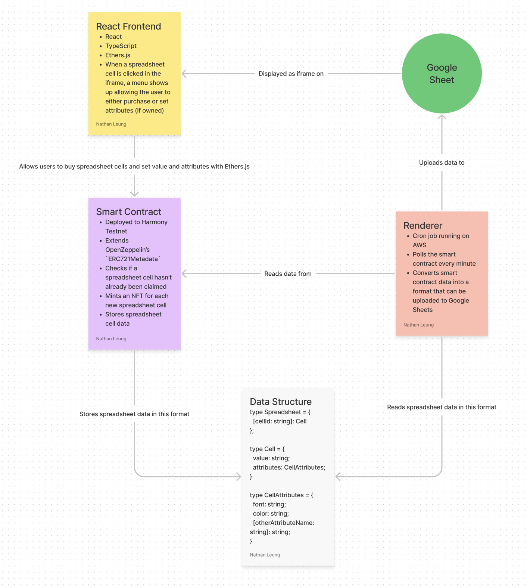

# NFSheets

Create a spreadsheet collaboratively on the blockchain.

A project for the [Harmony University Hackathon](https://taikai.network/en/harmonyprotocol/hackathons/hackthefuture/overview).

## Project Components

- Twitter/Discord/etc. communities
  - Follow crypto people
- Smart Contract
  - Extend `ERC721Metadata`
- Frontend
  - Ethers.js, React
  - Examples: https://nonfungibleolivegardens.com/, https://constitutiondao.com, https://elfdao.com, https://monkeymafia.co/, https://boredapeyachtclub.com/#/, https://linksdao.io/, https://thousandetherhomepage.com/, https://opensea.io/collection/thousand-ether-homepage

## Rules

- Teams of 2-4 are encouraged
- Submissions will need 4 components - video walkthrough, GitHub, launch on testnet, names of team members & their Twitter handles
- Must feature complete product = can connect to a wallet, can be tested with testnet tokens by 50 users
- Winners must show at least 10 unique wallet addresses interacted with the product
- Full rules: https://taikai.network/en/harmonyprotocol/hackathons/hackthefuture/rules
- Project Submission Deadline: January 12th, 2022

## Repository Structure

This project was bootstrapped with [Create React App](https://github.com/facebook/create-react-app).

- `src/` - React frontend
- `contracts/` - smart contracts
- `renderer/` - spreadsheet renderer that takes data from the blockchain and uploads it to Google Sheets

### Create React App NPM scripts

In the project directory, you can run:

#### `npm start`

Runs the app in the development mode.\
Open [http://localhost:3000](http://localhost:3000) to view it in the browser.

The page will reload if you make edits.\
You will also see any lint errors in the console.

#### `npm test`

Launches the test runner in the interactive watch mode.\
See the section about [running tests](https://facebook.github.io/create-react-app/docs/running-tests) for more information.

#### `npm run build`

Builds the app for production to the `build` folder.\
It correctly bundles React in production mode and optimizes the build for the best performance.

The build is minified and the filenames include the hashes.\
Your app is ready to be deployed!

See the section about [deployment](https://facebook.github.io/create-react-app/docs/deployment) for more information.
